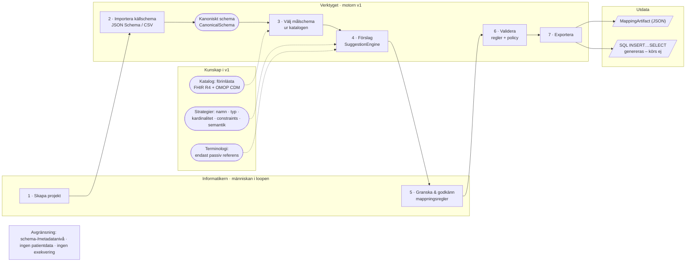
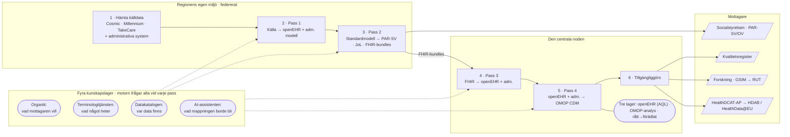
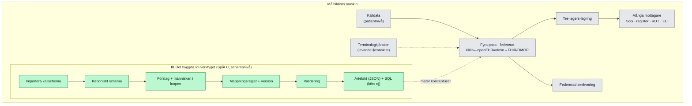

# Två flöden sida vid sida: den byggda lösningen vs. målbilden

**Status:** v1.0 · 2026-06-18
**Roll:** Pedagogisk, illustrationsfärdig beskrivning av två flöden så att de kan jämföras direkt:
**A)** verktyget som faktiskt är byggt i det här repot, och **B)** den totala mappningslösningens
målbild när allt är på plats. Varje flöde har samma upplägg — en mening i klartext, ett stegspår,
de kunskapskällor som konsulteras, vad som produceras, och ett diagram. Sist en överlagrad
jämförelse som visar *var i målbilden bygget sitter*.

> Diagrammen är skrivna i Mermaid och renderas direkt på GitHub. De är samtidigt en exakt
> nod-/kantspecifikation för en senare, mer påkostad illustration: samma noder, samma pilar.

**Gemensam legend (gäller båda flödena):**

| Symbol | Betyder |
|---|---|
| ▭ rektangel | Ett **steg/pass** — något händer med datan |
| ⬭ rundad | En **kunskapskälla** motorn frågar (svarar, transformerar inte) |
| ▱ parallellogram | **Ut­data / mottagare** |
| 🟩 grön | Realiserat i den byggda lösningen |
| ⬜ grå | Ingår i målbilden men **ej byggt** i v1 |

---

## Flöde A — Den byggda lösningen (v1-verktyget)

### Essensen i en mening
En informatiker importerar ett **källschema**, väljer ett **målschema**, låter verktyget **föreslå**
fält-för-fält-mappningar, **godkänner** dem för hand, **validerar**, och **exporterar** en
maskinläsbar artefakt plus ett SQL-skript. Allt sker på **schema-/metadatanivå** — ingen patientdata
rör sig, och inget skript körs.

### Aktörer / lager
- **Informatikern** – människan i loopen som granskar och godkänner.
- **Verktyget (motorn v1)** – FastAPI-backend + React-gränssnitt, in-memory-tillstånd.
- **Kunskap i v1** – en katalog med förinlästa standarder och en uppsättning poängsättnings­strategier.
- **Utdata** – en JSON-artefakt och ett SQL-skript.

### Stegspår (det användaren går igenom)
1. **Skapa projekt** — `POST /projects`. Roll ≥ analyst. Ger ett `MappingProject` (status DRAFT) och en `AuditEvent`.
2. **Importera källschema** — `POST …/schemas/source/import`. En **adapter** parsar formatet till ett
   neutralt **`CanonicalSchema`** (fält med stabil id, path, typ, kardinalitet, constraints,
   terminologireferenser). *Fungerande adaptrar i v1: **JSON Schema** och **CSV**. Övriga fem
   (FHIR-profil, OMOP, openEHR, SQL DDL, Parquet) är stubbar.*
3. **Välj målschema ur katalogen** — `GET /catalog/schemas` + `POST …/schemas/target/select`.
   Katalogen är **förinläst** med **FHIR R4** (9 resurser) och **OMOP CDM 5.4** (11 tabeller) som
   färdiga målscheman. Källa och mål "pinnas" till projektet.
4. **Få förslag** — `POST …/suggestions`. `SuggestionEngine` poängsätter varje källfält mot varje
   målfält med viktade, **förklarbara** strategier: namnlikhet, typlikhet, kardinalitet, constraints,
   och en valfri **semantisk** strategi (default = deterministisk lexikal; alternativt **Azure
   OpenAI**-embeddings om nyckel finns). Returnerar topp-K kandidater med konfidens och skäl.
5. **Granska & skapa mappningsversion** — `POST …/mappings`. Informatikern accepterar/justerar och
   sparar **`MappingRule`**-rader (mål­fält ← ett/flera källfält + transform-typ: DIRECT, CONCATENATE,
   SPLIT, LOOKUP, CONSTANT, DEFAULT, CUSTOM). Resultatet är en **immutabel `MappingVersion`**. AuditEvent loggas.
6. **Validera** — `POST …/validate`. Regelmotor kör t.ex. *target_field_exists* (ERROR),
   *required_target_mapped*, *type_compatibility* (WARN), *source_field_exists*. Allvarlighetsgrad
   styrs av en **policy per anrop** (inte hårdkodad). Ger en lista med issues + åtgärdstips.
7. **Exportera** — `POST …/export`. Bygger en **`MappingArtifact`** (projekt + version) som
   **deterministisk JSON**, och genererar ett **SQL `INSERT … SELECT`**-skript. **Skriptet är en
   beskrivning — det körs aldrig i v1.**

### Kunskapskällor som konsulteras
Katalogen (förinlästa standarder) och poängsättnings­strategierna. Terminologi finns bara som en
**passiv referens** på fältnivå — ingen terminologitjänst anropas.

### Vad som produceras
`MappingArtifact` (JSON) + `transformation_script` (SQL). Båda är byte-deterministiska.

### Röda linjer (medvetet utanför v1)
Ingen exekvering av skript (RL-01). Ingen patient-/individdata (RL-02). In-memory-lagring, simulerad
RBAC via headers.

---

## Flöde B — Målbilden (hela maskinen)

### Essensen i en mening
Data lämnar **aldrig** regionen i onödan: **en mappningsmotor** körs i **fyra pass**, frågar **fyra
kunskapslager** vid varje transformation, standardiserar patientdata genom **openEHR + en
administrativ modell**, och den **centrala noden** sammanställer resultatet och vidarebefordrar det
till många mottagare — från Socialstyrelsen till europeisk forskning.

### Aktörer / lager
- **Regionens egen miljö** – källsystemen och pass 1–2 körs federerat där datan bor.
- **Den centrala noden** – tar emot, kör pass 3–4, lagrar och exponerar.
- **Fyra kunskapslager** – konsulteras vid *varje* pass (se band i diagrammet).
- **Mottagare** – nationella och europeiska konsumenter av standardiserad data.

### Stegspår (sex steg, varav fyra är pass genom motorn)
1. **(Regionalt) Hämta källdata** — från kliniska system (Cosmic, Millennium, TakeCare: diagnoser,
   åtgärder, labb, läkemedel) och administrativa system (väntetider, remisser, bemanning, ekonomi).
2. **(Regionalt) Pass 1: Källa → openEHR + administrativ modell.** Rådata normaliseras till den
   gemensamma standardmodellen.
3. **(Regionalt) Pass 2: Standardmodell → utgående format** (PAR-SV/OV, JoL-meddelanden,
   FHIR-bundles). Ursprungskoder (ICD-10, KVÅ) bevaras för Socialstyrelsen.
4. **(Centralt) Noden tar emot FHIR-bundles · Pass 3: FHIR → openEHR + admin.** Den omvända
   transformationen centralt.
5. **(Centralt) Pass 4: openEHR + admin → OMOP CDM.** Analysformat för population/forskning.
6. **(Centralt) Tillgängliggörs** — via **Datakatalogen**, **GSIM**-export till Vetenskapsrådets
   **RUT**, och **HealthDCAT-AP**-beskrivningar för **HDAB** och **HealthData@EU**.

### De fyra kunskapslagren (motorn frågar alla, varje pass)
- **Organik** — *vad mottagaren vill ha* (registerfrågor, grunddata, härledningsregler).
- **Terminologitjänsten** — *vad något heter* i standardformat (ConceptMaps/ValueSets, Inera).
- **Datakatalogen** — *var data finns* (tabeller, kolumner, lokala koder, kvalitetsmetrik).
- **AI-assistenten** — *vad mappningen borde bli*, förbättras av varje mänsklig validering.

### Lagring i tre lager
**Operativt openEHR-lager** (longitudinell journal, nås via AQL) · **analyslager i OMOP-form**
(varje variabel en gång) · princip **rått → förädlat** (rålogg med proveniens, sedan normalisering).

### Federation och hävstång
Koden körs i regionens miljö; resultatet skickas till noden. **Substratoberoende** — Denodo/SSIS,
kommersiell CDR, vad som helst — så länge **kontraktet** uppfylls. Hävstången ligger i kontraktet,
inte i leverantörsvalet.

---

## Jämförelsen: var sitter bygget i målbilden?

Den byggda lösningen är en **körbar realisering av en avgränsad del av målbilden — främst Spår C**
(bygg motorn stegvis): maskinläsbara artefakter, registret som tjänst och AI-lagret med människan i
loopen. Det gör grovjobbet på **schemanivå**, men de federerade passen, patientnivån, den levande
terminologitjänsten, tre-lagers-lagringen och exekveringen tillhör målbilden runtomkring.

### Överlagrad karta (grönt = byggt, grått = målbild men ej byggt)

### Jämförelsetabell (samma axlar, båda flödena)

| Axel | A · Byggt v1-verktyg | B · Målbilden |
|---|---|---|
| **Pass** | Ett generiskt källa→mål-pass | Fyra namngivna pass (källa↔openEHR/admin↔FHIR↔OMOP) |
| **Nivå** | Schema/metadata | Patientnivå (Condition, Procedure m.fl.) |
| **Datarörelse** | Ingen data rör sig | Federerat: kod körs där datan bor, resultat till noden |
| **Exekvering** | Genererar SQL — **kör aldrig** (RL-01) | Federerad körning av transformationen |
| **Terminologi** | Passiv referens på fältnivå | Levande Terminologitjänst ($translate/$validate-code) |
| **Kunskapskällor** | Katalog + poängstrategier | Fyra lager: Organik · Terminologi · Datakatalog · AI |
| **Lärande** | Audit fångar beslut (matas ej tillbaka än) | Lärloop: varje validering förbättrar maskinen |
| **Lagring** | In-memory artefakt + versioner | Tre lager: openEHR (AQL) · OMOP-analys · rått→förädlat |
| **Mottagare** | Exportartefakt (JSON) + SQL-beskrivning | SoS/PAR · kvalitetsregister · RUT · HealthData@EU |
| **Indata-format** | JSON Schema + CSV (FHIR/OMOP som förinlästa mål) | Kliniska + administrativa källsystem |
| **Människan i loopen** | ✅ kärnan i flödet | ✅ samma mönster, uppskalat av AI-lagret |
| **Standardmodell som nav** | ✅ `CanonicalSchema` | ✅ openEHR + administrativ modell |

### Så läser man de två illustrationerna mot varandra
- **Samma DNA:** båda har ett **nav** (kanoniskt schema ↔ openEHR/admin), **människan i loopen**, och
  **pluggbara mål utan att motorn ändras**. Bygget bevisar mönstret i smått.
- **Skillnaden är skala och rörelse:** målbilden lägger till **federerad körning**, **fyra pass på
  patientnivå**, en **levande terminologitjänst**, **tre-lagers-lagring** och **många mottagare**.
- **Den gröna ön i den grå kartan** är precis det v1 redan kör: importera → kanoniskt schema →
  förslag → mänskligt godkännande → validering → artefakt. Resten av den grå kartan är vägen kvar.

> Detaljerad gap- och konvergensanalys (med filhänvisningar och prioriterade hävstänger) finns i
> [`kchd-vision-vs-build.md`](./kchd-vision-vs-build.md). Källinnehållet för båda flödena kommer från
> [`kchd_mappning_kunskapskalla.md`](./kchd_mappning_kunskapskalla.md) och repots faktiska kod.
